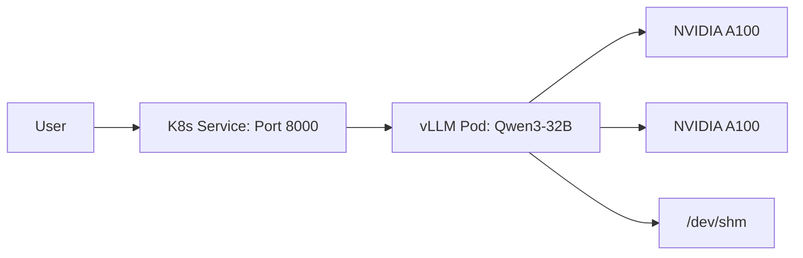

Deploying Large Language Models (LLMs) requires precise orchestration of specialized hardware and optimized software. vLLM is a high-throughput serving engine that, when combined with Google Kubernetes Engine (GKE), provides a scalable production environment for inference.<d-footnote>See <a href="https://docs.vllm.ai/">vLLM Documentation</a>, <a href="https://cloud.google.com/kubernetes-engine/docs">GKE Documentation</a>, and <a href="https://cloud.google.com/kubernetes-engine/docs/integrations/ai-infra">AI/ML orchestration on GKE</a> for official guides.</d-footnote> This comprehensive guide details how to select resources and deploy vLLM for both GPU and TPU use cases, with professional, step-by-step instructions and the necessary GCP configurations and Kubernetes manifests.

## Introduction to High-Performance LLM Serving with vLLM on GKE

vLLM is a state-of-the-art inference engine that achieves impressive serving performance by efficiently managing attention key-value (KV) memory using PagedAttention. When combined with GKE, users can leverage a fully managed, scalable, and secure environment for running containers with specialized accelerator hardware. GKE provides seamless integration with both NVIDIA GPUs and Google's custom TPUs, making it an ideal platform for hosting complex LLM workloads in a reliable and cost-effective manner.

The choice between GPUs and TPUs depends heavily on the specific model and the target performance metrics. For example:

* **NVIDIA GPUs (e.g., L4, A100):** Offer broad compatibility with various model architectures, frameworks, and drivers, and are supported by a wide ecosystem. They excel in many-node, high-bandwidth interconnectivity scenarios.
* **Google TPUs (e.g., v5e, v4):** Are custom-designed to accelerate machine learning workloads, providing exceptional performance-per-dollar and raw throughput, particularly for model architectures and operations supported by the JAX/XLA compiler chain. They are especially effective for certain large, complex models.

This guide will walk you through the end-to-end setup for both compute paths, detailing the configuration of GKE clusters, node pools, and Kubernetes deployments.

---

## Resource Selection Strategy

<aside><p><strong>Reference:</strong> <a href="https://cloud.google.com/kubernetes-engine/docs">GKE docs</a> · <a href="https://cloud.google.com/kubernetes-engine/docs/how-to/autopilot-gpus#request-gpus">Request GPUs (Autopilot)</a> · <a href="https://cloud.google.com/kubernetes-engine/docs/how-to/gpus">GPU Support</a> · <a href="https://cloud.google.com/kubernetes-engine/docs/how-to/tpus">TPU Support</a></p></aside>

Choosing the correct infrastructure is the most critical step in LLM deployment. The following configurations are based on model size and performance requirements.

### Cluster Mode Selection

GKE offers two operating modes. For most high-performance LLM workloads, **Standard Mode** is preferred for granular control over node pools and placement policies.

| Mode | Use Case | GPU/TPU Request |
| --- | --- | --- |
| **Autopilot** | Fully managed; minimal ops | Per-pod resource requests |
| **Standard** | Full control; performance tuning | Custom node pools with specific accelerators |

### GPU Accelerator Selection

GPUs provide broad compatibility with the vLLM ecosystem.

* **NVIDIA L4:** Cost-effective for small to medium models (7B - 13B) or high-density deployments.
* **NVIDIA A100 (40GB/80GB):** The industry standard for large models (32B+). 80GB version is preferred for long context windows.
* **NVIDIA H100 (80GB):** Highest performance for massive models or ultra-low latency requirements.

### TPU Accelerator Selection

TPUs are Google's custom-built AI accelerators, often offering better price-to-performance for specific model architectures supported by JAX/XLA.

* **TPU v5e (Lite):** Highly efficient for inference. Used in "podslices" (e.g., 2x2, 2x4).
* **TPU v5p / v6e:** Designed for maximum throughput and extremely large-scale training and inference.

### Model Size to Resource Mapping

| Model Size | Recommended Accelerator | RAM/VRAM | GKE Node Type |
| --- | --- | --- | --- |
| **Small (≤7B)** | 1x NVIDIA L4 or TPU v5e-4 | 24GB+ | g2-standard-8 |
| **Medium (32B)** | 2x NVIDIA A100 or 4x L4 | 80GB+ | g2-standard-48 / a2-highgpu-2g |
| **Large (70B+)** | 8x NVIDIA A100/H100 or TPU v5e-8 | 320GB+ | a3-highgpu-8g / ct5lp-hightpu-8t |

---

## Architecture of vLLM on GKE with Multi-Accelerator Support

The diagram above visually outlines the deployment strategy. A single GKE cluster is provisioned to host both optimized compute environments. The path on the left represents the standard GPU-accelerated deployment, utilizing an A100 node pool (or L4/H100) running **Qwen3-32B**. The path on the right shows the specialized TPU deployment using a `tpu-v5e-4` podslice to serve **Llama-3.1-8B**. In both cases, the vLLM serving engine runs inside a Kubernetes Pod managed by GKE.

---

## Phase 1: Common GKE Infrastructure and Setup

<aside><p><strong>Reference:</strong> <a href="https://cloud.google.com/kubernetes-engine/docs">GKE Documentation</a> · <a href="https://kubernetes.io/docs/tasks/manage-gpus/scheduling-gpus/">Kubernetes GPU Scheduling</a></p></aside>

Before deploying accelerator-specific node pools, we must establish the base GKE cluster and the security configuration required for accessing modern LLMs, which are often hosted behind gated repositories.

### 1. Prerequisites and Environment Variables

You will need an active GCP project with billing enabled, the `gcloud` SDK installed and authenticated, and `kubectl` configured. Begin by defining standard environment variables to use throughout the deployment.

```bash
# General GKE Configuration (or use: export PROJECT_ID=$(gcloud config get-value project))
export PROJECT_ID=<your-gcp-project-id>
export LOCATION=us-central1           # Example region supporting GPUs and TPUs
export CLUSTER_NAME=vllm-multicluster
export NAMESPACE=vllm

# TPU-Specific variables (Example for v5e-4, 2x2 topology for Llama-3.1-8B)
export TPU_POOL_NAME=tpu-pool-v5e-4
export TPU_MACHINE_TYPE=ct5lp-hightpu-4t
export TPU_TOPOLOGY=2x2

# GPU-Specific variables (Example for A100, for Qwen3-32B)
export GPU_POOL_NAME=gpu-pool-a100
export GPU_MACHINE_TYPE=a2-highgpu-2g
export GPU_ACCELERATOR_TYPE=nvidia-tesla-a100

```

*Replace `<your-gcp-project-id>` with your actual project identification. Common regions with high accelerator availability include `us-central1`, `us-east1`, and `europe-west1`. Ensure the selected region has quota for your target GPU and TPU types.*

### 2. Create the GKE Cluster

Run the following command to create a regional GKE cluster. Note that we provide a minimal default node pool here; we will add specialized pools shortly. The `--enable-ip-alias` and `--workload-pool` flags are critical for networking and security.

```bash
gcloud container clusters create $CLUSTER_NAME \
  --location=$LOCATION \
  --workload-pool=$PROJECT_ID.svc.id.goog \
  --enable-ip-alias \
  --enable-image-streaming \
  --num-nodes=1 \
  --machine-type=e2-standard-4

```

*The `e2-standard-4` default pool ensures the cluster control plane and system pods can run, while we reserve specialized machines for the vLLM workloads. The `--enable-image-streaming` flag speeds up container startup by streaming image layers on demand.*

### 3. Get Cluster Credentials and Create a Namespace

Authenticate your local `kubectl` to interact with the new cluster and create a dedicated namespace to isolate the vLLM resources.

```bash
gcloud container clusters get-credentials $CLUSTER_NAME --location=$LOCATION
kubectl create namespace $NAMESPACE

```

### 4. Configure Access to Hugging Face Models

Both model use cases in this guide (Qwen and Llama) are popular open-weight models but often require a Hugging Face token for gated access. vLLM needs your Hugging Face Hub token as an environment variable to download these models at container runtime.

Create the secret (replace `<your-huggingface-token>` with a valid 'Read' token from your <a href="https://huggingface.co/settings/tokens">Hugging Face settings</a>):<d-footnote><a href="https://huggingface.co/docs/hub/security-tokens">Hugging Face: Private models & tokens</a></d-footnote>

```bash
kubectl create secret generic vllm-secret \
  --from-literal=hf_api_token=<your-huggingface-token> \
  --namespace $NAMESPACE
```

*In production, use Workload Identity with Google Secret Manager for enhanced security.*

This secret is referenced as `HUGGING_FACE_HUB_TOKEN` in both the GPU and TPU deployment manifests.

---

## Use Case 1: Deploying vLLM with NVIDIA GPUs

<aside><p><strong>Reference:</strong> <a href="https://cloud.google.com/kubernetes-engine/docs/how-to/gpus">GKE GPU Support</a> · <a href="https://docs.vllm.ai/en/stable/deployment/k8s.html#deployment-with-gpus">vLLM K8s Deployment (GPUs)</a> · <a href="https://cloud.google.com/kubernetes-engine/docs/tutorials/serve-llama-gpus-vllm">Tutorial: Serve Llama on GKE with vLLM</a> · <a href="https://cloud.google.com/kubernetes-engine/docs/tutorials/serve-gemma-gpu-vllm">Tutorial: Serve Gemma on GKE with vLLM</a></p></aside>

We deploy **Qwen3-32B** using two NVIDIA A100 GPUs. For a 32B model, we configure engine arguments such as `--max-model-len` to stay within VRAM limits.

### GPU Architecture Flow



### 1. Create the GPU Node Pool

Use `gcloud` to add a new node pool to your existing cluster. This node pool must utilize a machine type that supports GPUs and explicitly request the accelerators.

```bash
gcloud container clusters node-pools create $GPU_POOL_NAME \
  --cluster=$CLUSTER_NAME \
  --location=$LOCATION \
  --machine-type=$GPU_MACHINE_TYPE \
  --accelerator=type=$GPU_ACCELERATOR_TYPE,count=2 \
  --num-nodes=1 \
  --enable-autoscaling --min-nodes=1 --max-nodes=5

```

*Key configuration notes:*

* `count=2`: For Qwen3-32B we use two A100 GPUs per node with tensor parallelism.
* `--enable-autoscaling`: GKE will automatically scale GPU nodes based on workload demands.

### 2. Apply the GPU Kubernetes Manifest

The manifest uses `nvidia.com/gpu: "2"` with `tensor-parallel-size=2` for the 32B model. Always mount `/dev/shm` for efficient NCCL communication between GPUs.

**`vllm-gpu-qwen.yaml`**

```yaml
apiVersion: apps/v1
kind: Deployment
metadata:
  name: vllm-qwen3-deployment
  namespace: vllm
spec:
  replicas: 1
  selector:
    matchLabels:
      app: vllm-qwen3-32b
  template:
    metadata:
      labels:
        app: vllm-qwen3-32b
    spec:
      containers:
      - name: inference-server
        image: docker.io/vllm/vllm-openai:v0.10.0
        ports:
        - containerPort: 8000
        resources:
          limits:
            nvidia.com/gpu: "2"
            memory: "96Gi"
            cpu: "12"
        args:
        - --model=$(MODEL_ID)
        - --tensor-parallel-size=2
        - --max-model-len=8000
        - --gpu-memory-utilization=0.95
        env:
        - name: MODEL_ID
          value: Qwen/Qwen3-32B
        - name: HUGGING_FACE_HUB_TOKEN
          valueFrom:
            secretKeyRef:
              name: vllm-secret
              key: hf_api_token
        volumeMounts:
        - mountPath: /dev/shm
          name: dshm
      volumes:
      - name: dshm
        emptyDir:
          medium: Memory
      nodeSelector:
        cloud.google.com/gke-accelerator: nvidia-tesla-a100
---
apiVersion: v1
kind: Service
metadata:
  name: vllm-qwen3-32b-service
  namespace: vllm
spec:
  ports:
  - port: 8000
    targetPort: 8000
    protocol: TCP
  selector:
    app: vllm-qwen3-32b
  type: ClusterIP
```

*Notes on the GPU Manifest:*

* `--tensor-parallel-size=2`: Splits the model across two GPUs.
* `--max-model-len=8000`: Adjust based on VRAM; reduce for longer context or larger batches.
* `--gpu-memory-utilization=0.95`: Tune down if running sidecar containers.
* `/dev/shm`: Required for efficient multi-GPU communication.

<aside><p><strong>Full list of engine options</strong>: <a href="https://docs.vllm.ai/en/latest/configuration/engine_args.html">vLLM Engine Args</a></p></aside>

Apply the manifest:

```bash
kubectl apply -f vllm-gpu-qwen.yaml
```

---

## Use Case 2: Deploying vLLM with Google TPUs

<aside><p><strong>Reference:</strong> <a href="https://cloud.google.com/kubernetes-engine/docs/how-to/tpus">GKE TPU Support</a> · <a href="https://docs.vllm.ai/en/stable/getting_started/installation/google_tpu.html">vLLM TPU Install</a> · <a href="https://cloud.google.com/kubernetes-engine/docs/tutorials/serve-vllm-tpu">Tutorial: Serve LLM on TPU Trillium with vLLM</a></p></aside>

We deploy **Llama-3.1-8B** using a TPU v5e podslice. TPU deployments require a `nodeSelector` for topology and accelerator type. vLLM uses a specialized TPU image and the XLA compiler.

### TPU Deployment Considerations

* **Topology:** A `2x2` topology indicates a slice of 4 TPU v5e chips. Use `2x4` for 8 chips on larger models.
* **GCS Fuse:** Recommended for loading large model weights efficiently from a Cloud Storage bucket.
* **XLA Cache:** To prevent slow startup times when scaling, store XLA caches on a persistent volume or Filestore. Set `VLLM_XLA_CACHE_PATH` to a per-pod location (e.g., `emptyDir`) to avoid race conditions with multi-replica deployments.

### 1. Create the TPU Node Pool

TPU nodes are typically provisioned in multi-node groups called "podslices," connected by a high-bandwidth interconnect. For v5e, we define the topology, such as `2x4` (totaling 8 chips). When creating the pool, you set the total number of VMs to match the required chip count.

```bash
# For a v5e-4 podslice (4 chips, 2x2), we require 4 VMs. Use num-nodes=8 for 2x4 (8 chips).
gcloud container clusters node-pools create $TPU_POOL_NAME \
  --cluster=$CLUSTER_NAME \
  --location=$LOCATION \
  --machine-type=$TPU_MACHINE_TYPE \
  --num-nodes=4 \
  --enable-autoscaling --min-nodes=4 --max-nodes=8

```

### 2. Apply the TPU Kubernetes Manifest

Below is the YAML for **Llama-3.1-8B** on a `2x2` (4-chip) TPU v5e podslice. The `gke-gcsfuse/volumes` annotation enables loading model weights from GCS.

**`vllm-tpu-llama.yaml`**

```yaml
apiVersion: apps/v1
kind: Deployment
metadata:
  name: vllm-llama-tpu
  namespace: vllm
spec:
  replicas: 1
  selector:
    matchLabels:
      app: vllm-llama3-8b-tpu
  template:
    metadata:
      labels:
        app: vllm-llama3-8b-tpu
      annotations:
        gke-gcsfuse/volumes: "true"
    spec:
      nodeSelector:
        cloud.google.com/gke-tpu-topology: 2x2
        cloud.google.com/gke-tpu-accelerator: tpu-v5-lite-podslice
      containers:
      - name: inference-server
        image: docker.io/vllm/vllm-tpu:v0.11.1
        ports:
        - containerPort: 8000
        args:
        - --model=meta-llama/Llama-3.1-8B
        - --tensor-parallel-size=4
        - --max-model-len=4096
        env:
        - name: VLLM_USE_V1
          value: "1"
        - name: HUGGING_FACE_HUB_TOKEN
          valueFrom:
            secretKeyRef:
              name: vllm-secret
              key: hf_api_token
        resources:
          limits:
            google.com/tpu: 4
        volumeMounts:
        - name: cache-volume
          mountPath: /root/.cache/huggingface
      volumes:
      - name: cache-volume
        emptyDir: {}
---
apiVersion: v1
kind: Service
metadata:
  name: vllm-llama3-8b-tpu-service
  namespace: vllm
spec:
  ports:
  - port: 8000
    targetPort: 8000
    protocol: TCP
  selector:
    app: vllm-llama3-8b-tpu
  type: ClusterIP
```

*Notes on the TPU Manifest:*

* `image: docker.io/vllm/vllm-tpu:v0.11.1`: TPU-specific image with XLA compiler support.
* `VLLM_USE_V1: "1"`: Enables the v1 inference engine for TPUs.
* `google.com/tpu: 4`: Matches the `2x2` topology (4 chips).
* For an 8-chip `2x4` topology, use `google.com/tpu: 8` and `--tensor-parallel-size=8`.

Apply the manifest:

```bash
kubectl apply -f vllm-tpu-llama.yaml
```

---

## Verification: Testing and Accessing the API

Once you have applied the relevant manifest, monitor the deployment progress. It can take several minutes for the pods to transition from `ContainerCreating` (when GKE is downloading the model weights) to `Running`.

```bash
# Check status for both GPU and TPU pods
kubectl get pods --namespace $NAMESPACE -w

```

When you see a Pod status of `Running`, verify that the vLLM engine is healthy. You can check the logs of the pod:

```bash
# Example for a GPU pod
kubectl logs deploy/vllm-qwen3-deployment --namespace $NAMESPACE

```

### Accessing the API locally

For initial validation, use Kubernetes port forwarding to securely connect to the cluster's internal Service from your local machine.

* **For the GPU Service (Qwen):**
```bash
kubectl port-forward service/vllm-qwen3-32b-service 8000:8000 --namespace $NAMESPACE

```


* **For the TPU Service (Llama):**
```bash
kubectl port-forward service/vllm-llama3-8b-tpu-service 8080:8000 --namespace $NAMESPACE

```


You can then open a new terminal window and send standard OpenAI-compatible requests using `curl`.

### Running a Test Query

* **Querying the GPU Deployment (Qwen3-32B):**
```bash
curl http://localhost:8000/v1/chat/completions \
  -H "Content-Type: application/json" \
  -d '{
    "model": "Qwen/Qwen3-32B",
    "messages": [{"role": "user", "content": "Explain Kubernetes in one sentence."}],
    "max_tokens": 100
  }'
```

* **Querying the TPU Deployment (Llama-3.1-8B):**
```bash
curl http://localhost:8080/v1/chat/completions \
  -H "Content-Type: application/json" \
  -d '{
    "model": "meta-llama/Llama-3.1-8B",
    "messages": [{"role": "user", "content": "Explain Kubernetes in one sentence."}],
    "max_tokens": 50
  }'
```


vLLM will return a JSON response containing the generated text, demonstrating that the inference engine is running effectively on your chosen accelerator.

---

## Storage and Optimization

<aside><p><strong>Reference:</strong> <a href="https://cloud.google.com/kubernetes-engine/docs/concepts/persistent-volumes">GKE Storage Classes & Persistent Volumes</a></p></aside>

### Persistent Volume Claim (PVC)

To avoid re-downloading model weights (which can exceed 100GB), mount a PersistentVolumeClaim. For multi-replica deployments sharing weights, **Filestore (RWX)** is recommended.

### XLA Cache Handling for TPUs

When scaling TPU replicas, multiple pods writing to the same XLA cache can cause race conditions.

1. Use **Filestore** mounted as `readOnly` for shared model weights.
2. Set `VLLM_XLA_CACHE_PATH` to a per-pod location using an `emptyDir` or a unique sub-directory on the PVC.

### Memory Optimization

* **Shared Memory:** Always mount `/dev/shm` for GPU pods to enable efficient NCCL communication.
* **GPU Utilization:** Adjust `--gpu-memory-utilization` (default 0.90) based on whether you run other sidecar containers in the same pod.

---

## Monitoring and Maintenance

### Verification Commands

Ensure accelerators are correctly allocated:

```bash
# Verify GPU allocation
kubectl get nodes -L cloud.google.com/gke-accelerator

# Verify TPU allocation (look for cloud-tpus.googleapis.com/tpu in ALLOCATABLE)
kubectl get nodes -o custom-columns=NAME:.metadata.name,ALLOCATABLE:.status.allocatable
```

### Cleanup

To avoid ongoing costs for GPU/TPU nodes, delete the node pools or the cluster when finished:

```bash
gcloud container clusters delete $CLUSTER_NAME --location=$LOCATION

```

---

## Conclusion

You have successfully deployed high-performance LLM serving environments on Google Kubernetes Engine using vLLM, demonstrating both GPU and TPU hardware accelerators. GKE's robust infrastructure management, combined with vLLM's efficient memory handling, provides a reliable foundation for scaling your machine learning applications.

When moving to production, consider further optimizations such as:

* Enabling Horizontal Pod Autoscaling (HPA) to dynamically adjust the number of serving replicas based on traffic load.
* Configuring monitoring and logging using Google Cloud Observability for deeper visibility into model performance.
* Exploring Spot VMs for cost-efficient GPU/TPU nodes (for non-critical workloads).

<aside><p><strong>Related tutorials:</strong> <a href="https://cloud.google.com/kubernetes-engine/docs/how-to/serve-llm-l4-ray">Serve LLM on L4 GPUs with Ray</a> · <a href="https://docs.ori.co/kubernetes/examples/stable-diffusion/">Stable Diffusion on Kubernetes (Ori)</a></p></aside>